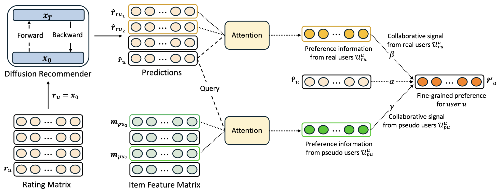

# Collaborative Diffusion Model for Recommender System (CDiff4Rec)
This repository provides the source code of our paper: ["Collaborative Diffusion Model for Recommender System (CDiff4Rec)"](https://arxiv.org/abs/2501.18997), accepted as a short paper at WWW 2025.

### 1. Overview
To effectively mitigate the loss of personalized information during the noise addition process in diffusion-based recommenders, CDiff4Rec generates pseudo-users from item features and leverages collaborative signals from both real and pseudo personalized neighbors.



### 2. Usage
Follow these three steps to use the code:
1. Unzip the dataset.
2. Create a Conda environment using `environment.yml`.
3. Run the code with the following command:
    ```
    ./run.sh [dataset] 
    ```
    The dataset can be one of: yelp, amazon_game, or citeulike_t.


### 3. Environment
Building upon [DiffRec](https://github.com/YiyanXu/DiffRec), our code is implemented in Python 3.9.0 and requires the following dependencies:

* pytorch=1.13.1
* pytorch-cuda=11.6
* numpy=1.24.3
  
For more details, refer to the environment.yml file.

### 4. Citation
If you use this code or our method in your research, please cite our paper:

```bibtex
@article{lee2025collaborative,
  title={Collaborative Diffusion Model for Recommender System},
  author={Lee, Gyuseok and Zhu, Yaochen and Yu, Hwanjo and Zhou, Yao and Li, Jundong},
  journal={arXiv preprint arXiv:2501.18997},
  year={2025}
}
```

